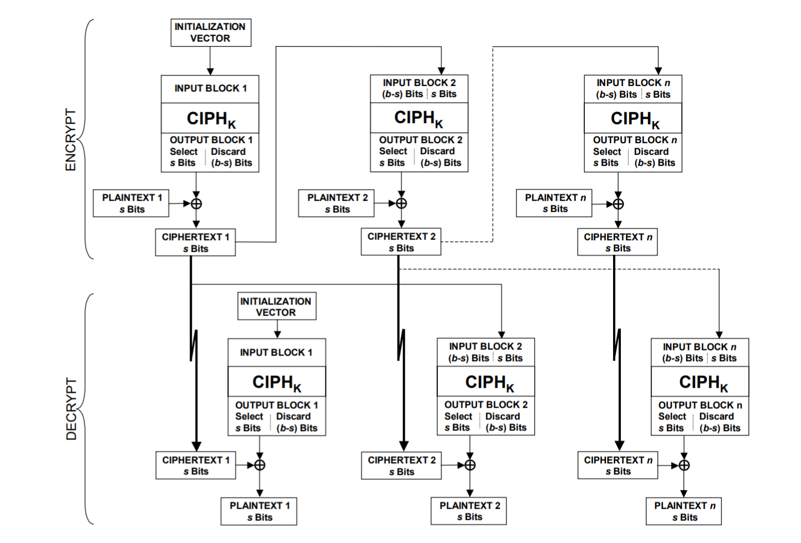

### JustDecrypt

[](https://shields.io/)[](https://shields.io/)

​	一道来自2021ByteCTF的Crypto，主要考察了AES CFB MODE以及一个不安全的`unpad()`.

#### :star2:0x1 Description

​	题目描述：It's just a decryption system. And I heard that only the Bytedancers can get secret. 

​	题目附件：`JustDecrypt.py` 


#### :star2:0x2 Analysis

题目一共分为两个阶段：1）暴力破解HASH；2）Chosen-ciphertext-attack in AES CFB MODE


**第一阶段**的主要逻辑定义在 `proof_of_work()` 方法中，

```python
    def proof_of_work(self):
        random.seed(urandom(32))
        alphabet = string.ascii_letters + string.digits
        proof = ''.join(random.choices(alphabet, k=32))
        hash_value = sha256(proof.encode()).hexdigest()
        self.send(f'sha256(XXXX+{proof[4:]}) == {hash_value}'.encode())
        nonce = self.recv(prompt=b'Give me XXXX > ')
        if len(nonce) != 4 or sha256(nonce + proof[4:].encode()).hexdigest() != hash_value:
            return False
        return True
```

alphabet的长度为62，而我们需要暴力破解原文的子串长度只有4，因此可能的原文仅有 $62^4=14776336$ 种，我们能够在PPT内解决（其实相当的快）

Exploit代码如下

```python
def hash_collid(tar_hash, proof_back):

    with open('./prefix', 'rb') as f:
        prefix_set = pickle.load(f)

    for prefix in tqdm(prefix_set):
        temp = prefix + proof_back
        if hashlib.sha256(temp.encode()).hexdigest() == tar_hash:
            print(red('[*]Found!  ') + prefix)
            return prefix
```

其中预先计算了所有可能的原文子串


**第二阶段** chall为我们提供了一个解密Oracle，并且该Oracle使用的是AES CFB MODE，我们需要构造出恰当的密文以使其解密出的明文在 `unpad` 后为：`Hello, I'm a Bytedancer. Please give me the flag!` 在padding过程中采用了与PKCS #7相似的算法，不过在 `unpad`方法中存在漏洞，我们能够直接获取Oracle解密后的明文

```python
    @staticmethod
    def unpad(s):
        return s[:-s[-1]]
```

并且出于Oracle的访问限制，我们与其交互的次数有限，很有可能不能够在有限的次数内还原出合法padding的明文，但利用上述漏洞我们可以构造出符合条件的plaintext {`Hello, I'm a Bytedancer. Please give me the flag!`} 而不用合法的padding


接下来我们需要详细考察一下AES CFB MODE


##### :star2:AES CFB MODE

在pycryptodome库中，AES_MODE_CFB的实现依照[NIST SP 800-38A, section 6.3](http://csrc.nist.gov/publications/nistpubs/800-38a/sp800-38a.pdf)，其大致的加解密流程如下图所示，



​	数学表述为：
$$
CFB\space Encryption\\
\space I_1 = IV;\\
I_j = LSB_{b-s}(I_{j-1})|C^{\#}_{j-1}\space for\space j=2...n;\\
O_j = CIPH_K(I_j)\space for\space j=1,2...n; \\
C^{\#}_j=P^{\#}_j\oplus MSB_s(O_j)\space for\space j=1,2...n;\\
\\
CFB\space Decryption\\
I_1=IV;\\
I_j = LSB_{b-s}(I_{j-1})|C^{\#}_{j-1}\space for\space j=2...n;\\
O_j = CIPH_K(I_j)\space for\space j=1,2...n;\\
P^\#_j=C^\#_j\oplus MSB_s(O_j)\space for\space j=1,2...n
$$
LSB（least significant bits）<u>数二进制表示的低比特位</u> ，MSB（most significant bits）<u>数二进制表示的高比特位</u>

在pycryptodome库中，使用AES_MODE_CFB构造Cipher时有一个特殊的参数`segment_size` 其指示了plaintext与ciphertext的segement，在Doc中其描述为，

> ​      **segment_size** (*integer*) 
>
> ​      (Only ``MODE_CFB``). The number of **bits** the plaintext and ciphertext are segmented in. It must be a multiple of 8.
>
> ​      If not specified, it will be assumed to be 8.

我们可以使用AES_MODE_ECB来实现AES_MODE_CFB，具体的实现在本WP中不在多述

我们回到chall中，由于该方案使用了不安全的`unpad()`方法，我们能够构造一个长ciphertext（这里我用了1024Bit）使得上述 $CIPH_K(I_j)$ 内容泄露。

利用泄露的 $CIPH_K(I_j)$ 与我们已知的明文作XOR运算，便可以得到对应的密文，由此我们能够逐Byte恢复密文信息。但由于与Oracle的交互次数有限，我们并不能够得到合法的padding后的明文所对应的密文，因此我们需要利用`unpad()`

按照上述方法构造`Hello, I'm a Bytedancer. Please give me the flag!`对应的ciphertext，接着在获得的密文后添加`'00' * 30`来覆盖nonce，得到我们一开始恢复 `H` 所使用的 $CIPH_K(I_0)$ 高s位 （在实施攻击前我们需要用密文 `'00'*512` 来覆盖nonce从而控制Decrypt流 {Cipher内部状态} ），计算 $MSB_{s}(CIPH_K(I_{0}))\oplus0X1F$ 其中0X1F是我们在密文后添加的Byte个数，利用 `unpad()` 中的逻辑 `s[:-s[-1]]` 我们能够去除多余密文所带来的杂乱明文，这样便能够成功攻击该密码方案，获得FLAG。

#### :star2: 0x3 EXPLOITED

```python
import hashlib
from tqdm import tqdm
import pickle
from curtsies.fmtfuncs import red
from pwn import *
import codecs
import binascii
import re

io = remote('39.105.181.182', 30001)
target_plaintext = b"Hello, I'm a Bytedancer. Please give me the flag!"


def interactive_pharse1(io):

    temp = io.recvuntil(b'Give me XXXX >')
    tar_hash = temp[temp.find(b'==')+3:temp.find(b'==')+3+64].decode()
    proof_back = temp[temp.find(b'XXXX')+5:temp.find(b'XXXX')+5+28].decode()
    proof_prefix = hash_collid(tar_hash, proof_back)
    io.sendline(proof_prefix.encode())
    return io


def hash_collid(tar_hash, proof_back):

    with open('./prefix', 'rb') as f:
        prefix_set = pickle.load(f)

    for prefix in tqdm(prefix_set):
        temp = prefix + proof_back
        if hashlib.sha256(temp.encode()).hexdigest() == tar_hash:
            print(red('[*]Found!  ') + prefix)
            return prefix


def interactive_pharse2(io, cip, flag=0):

    io.recvuntil(b'Please enter your cipher in hex >')
    io.sendline(cip)
    io.recvuntil(b' Your plaintext in hex: \n')
    plaintext = io.recvuntil(b'\n\n')
    if flag == 1:
        io.recvuntil(b'OK! Here is your flag: ')
        string = io.recv().decode()
        print(red("[+] Here's the Flag: ") +
              re.search('ByteCTF{.*}', string).group(0))
        return
    print(plaintext)
    return plaintext[:-2]


def atk(io):
    global target_plaintext
    cip = [b'\x00'] * 512
    leak_byte1 = interactive_pharse2(
        io, codecs.encode(b''.join(cip), 'hex'))[-2:]
    cip[0] = xor(binascii.unhexlify(leak_byte1), b'H')
    for i in range(1, len(target_plaintext)):
        plaintext = interactive_pharse2(
            io, codecs.encode(b''.join(cip), 'hex'))
        leak_byte = plaintext[i*2:i*2+2]
        cip[i] = xor(binascii.unhexlify(leak_byte), target_plaintext[i])
        print(red('[*] cipertext: '), codecs.encode(b''.join(cip), 'hex'))
    cip = b''.join([cip[v] for v in range(79)])
    cip += xor(bytes.fromhex('1f'), binascii.unhexlify(leak_byte1))
    interactive_pharse2(io, codecs.encode(cip, 'hex'), 1)


if __name__ == '__main__':
    interactive_pharse1(io)
    atk(io)

```


:star2: **ByteCTF{8de1d3e1-5e74-4a73-b99e-7dc860183f96}**
